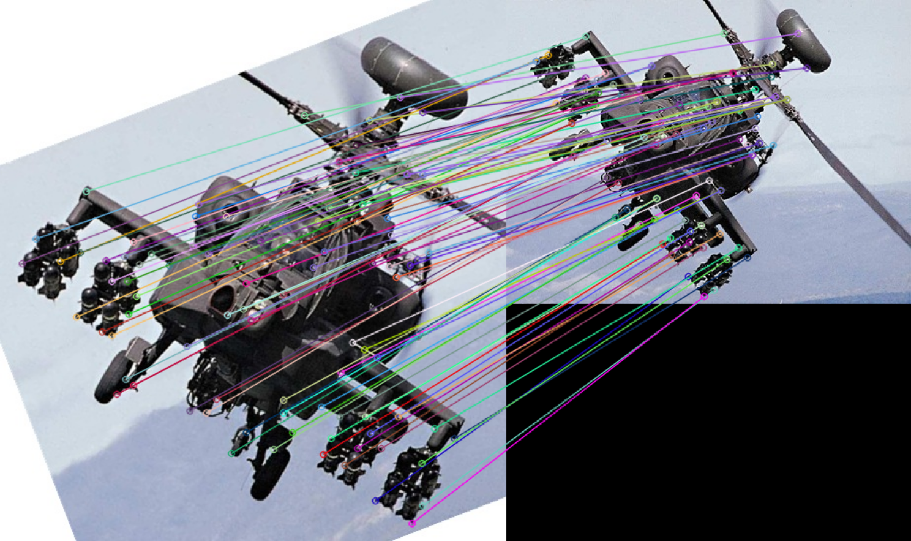
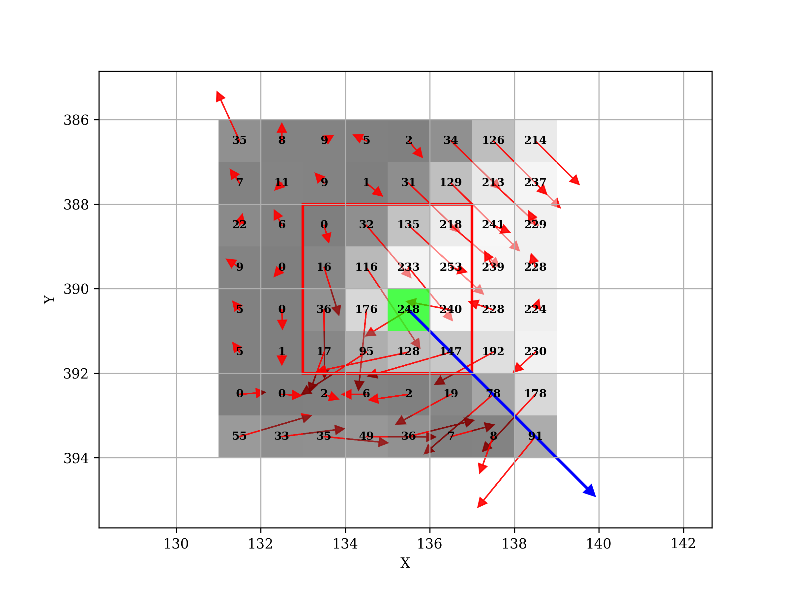
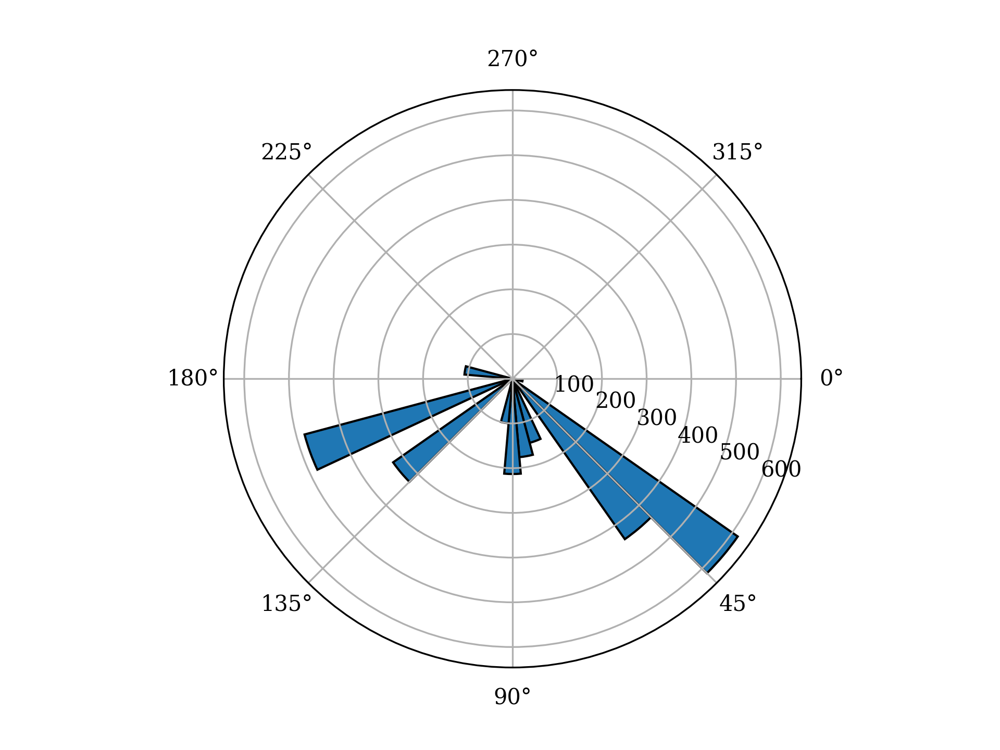
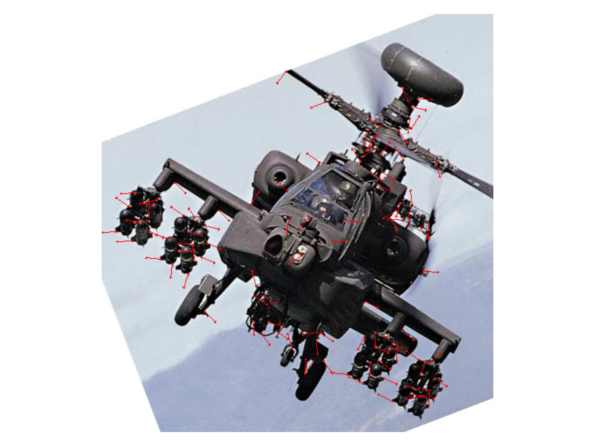
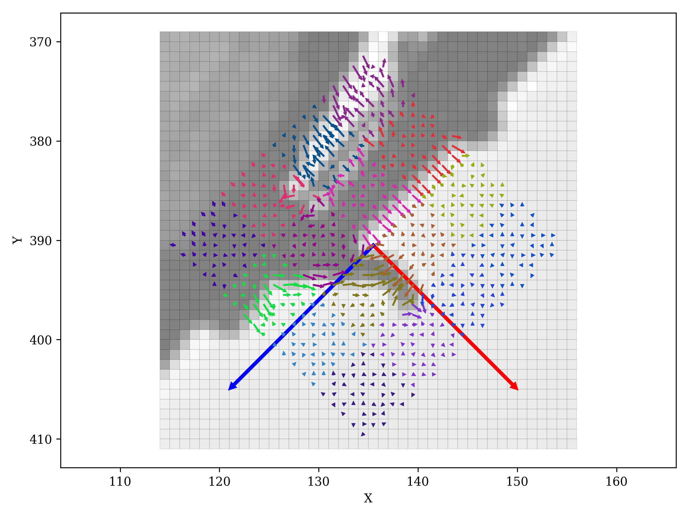
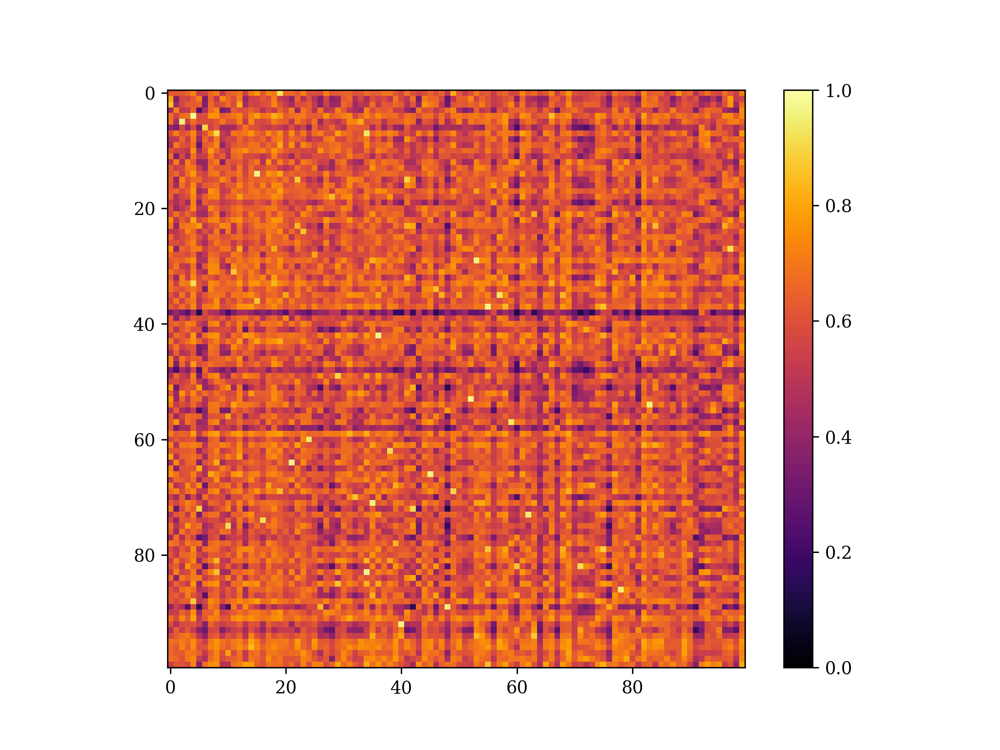
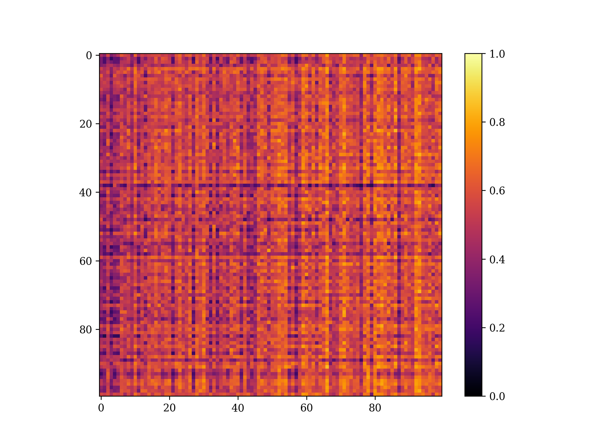

# ICE2607 Lab3: Scale Invariant Feature Transform (SIFT)

This project simplifies **SIFT** algorithm with a command-line interface and customizable parameters. It provides the convenience of plotting matching results, gradient visualizations, and similarity heat maps.

## File Structure

- `src/`
    - `main.py`: Main Python script.
    - `plot.py`: Contains functions for visualizing SIFT algorithm.
    - `sift.py`: Contains the implementation of the SIFT class.
- `dataset/`: Contains default dataset images.
- `results/`: Contains SIFT matching results of default images.
- `figures/`: Contains visualizing figures of default images.
- `target.jpg`: Default target image.
- `Lab3_report.pdf`
- `README.md`
- `Makefile`
- `requirements.txt`

## Example

### Matching result



### Gradient Visualizations

|  |  |
|:--:|:--:|
| Gradient Field | Gradient Histogram |

|  | 
|:--:|:--:|
| Main Orientations | Neighboring Gradients |

### Similarity Heat Map

|  |  |
|:--:|:--:|
| Well-Matching Heat Map | Poor-Matching Heat Map

## Install

1. Ensure that you have Python installed on your system.

2. Clone or download this project and navigate to the project directory.

3. Check if the dependencies listed in `requirements.txt` are installed. If not, create a virtual environment (if necessary) and run `make install`.

## Usage

### Default SIFT

```
python -m src.main \
    --image-dir path/to/dataset/images \
    --target-dir path/to/target/image \
    --output-dir path/to/output/folder \
    --output-type png
```

Note:
- `image-dir` can be path to the dataset image or the folder containing dataset images.
- Avoid duplicate filenames in `image-dir`.
- If the parameters are not specified, the program will utilize **target.jpg** as the target image, five images in the **./dataset** directory as dataset images and save all results in **PNG** format to the **./results** directory.
- If you want to use OpenCV's implementation, add `--opencv True`.

### Visualization

#### Preparation
```
from src.plot import *
image1 = cv2.imread("path/to/your/image1.jpg")
image2 = cv2.imread("path/to/your/image2.jpg")
print(find_corners(images1))
```
Use `find_corners()` to find the coordinates of keypoints.

#### Gradient Field
```
plot_local_grad(image1, (x, y), type='figure')
```

#### Gradient Histogram (Polar)
```
plot_local_grad(image1, (x, y), type='hist')
```

#### Main orientations
```
plot_global_grad(image1)
```

#### Neighboring Gradients
```
plot_neighbor_grad(image1, (x, y))
```

#### Similarity Heat Map
```
image1 = cv2.cvtColor(image1, cv2.COLOR_BGR2GRAY)
image2 = cv2.cvtColor(image2, cv2.COLOR_BGR2GRAY)
sift = SIFT()
kp1, dst1 = sift.detectAndCompute(image1, corner_num=100)
kp2, dst2 = sift.detectAndCompute(image2, corner_num=100)
plot_similarity(dst1, dst2)
```

Note:
- Replace `(x, y)` with one of the keypoint coordinates obtained during the preparation step.
- Certain plotting parameters, such as the size of arrows, may require manual adjustment based on your input image.